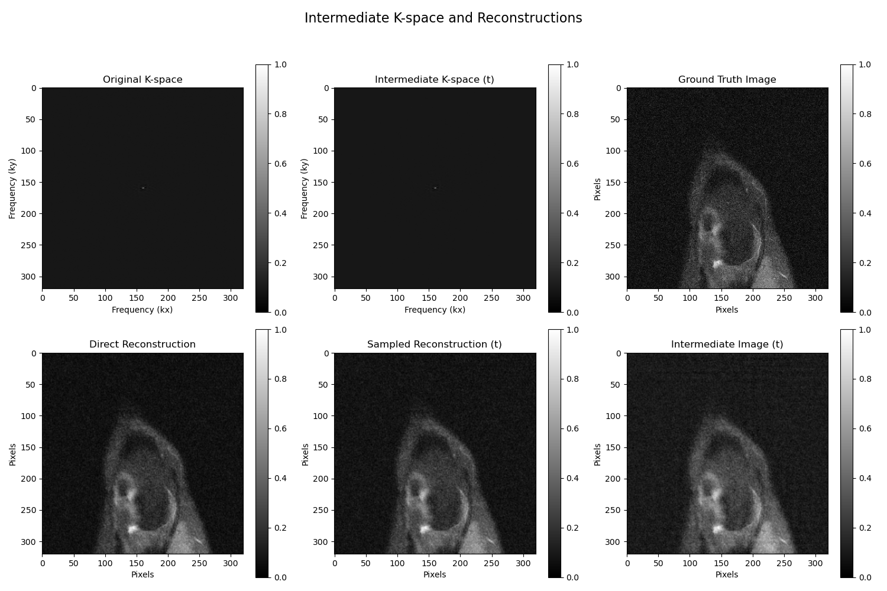

# MRI-K-space-Reconstruction
Recent research on Cold Diffusion ([Learning to reconstruct accelerated MRI through K-space cold diffusion without noise](https://www.nature.com/articles/s41598-024-72820-2)) has exceeded current benchmarks in reconstructing high-fidelity images from undersampled k-space data. 

XAI techniques aim to explore the contributions of specific regions and frequencies in k-space that significantly influence the reconstruction process. By providing detailed insights into the model’s focus on low-frequency regions for structural information and high-frequency regions for finer details, these techniques can guide the optimization of Cold Diffusion Models. Such analysis not only improves the interpretability and reliability of the reconstruction process but also paves the way for advanced techniques like frequency-aware degradation and latent space refinements, ensuring clinically accurate and explainable signal reconstruction from k-space. 
